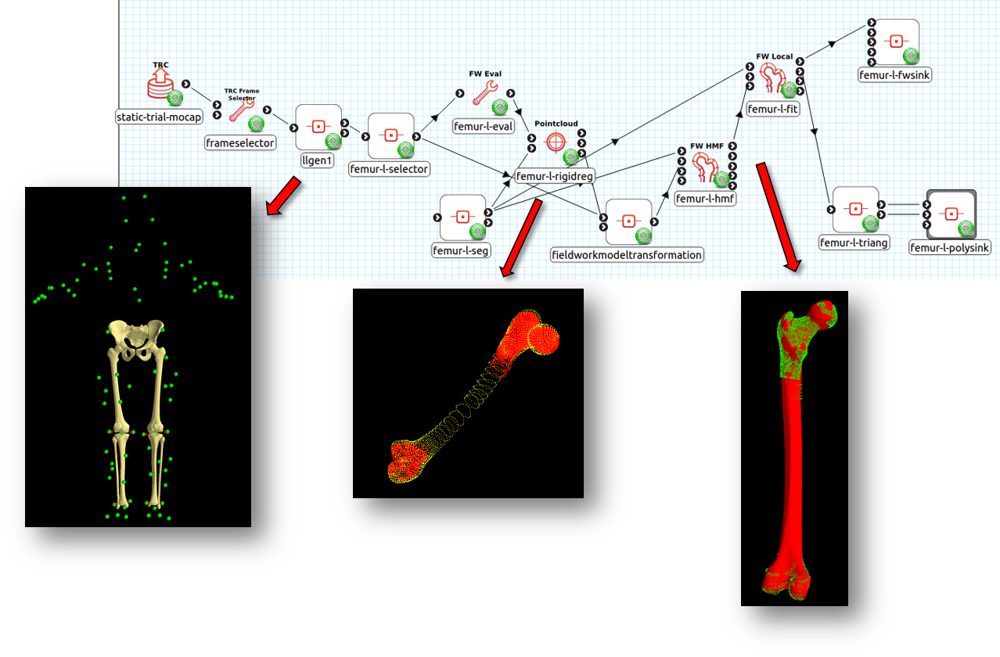

.. MAP-Client FAI Workshop documentation master file, created by
   sphinx-quickstart on Fri Sep  2 09:35:34 2016.
   You can adapt this file completely to your liking, but it should at least
   contain the root `toctree` directive.

***********************
MAP-Client FAI Workshop
***********************

*Version* |version|

This workshop aims to familiarise users to the `MAP Client <https://map-client.readthedocs.io/en/latest/index.html>`_ application and the development of MAP Client plugins. Examples and uses cases will focus on musculoskeletal model generation in the `FAI Project <https://www.griffith.edu.au/health/musculoskeletal-research>`_.

The MAP Client is a workflow management application with a suite of plugins that provide workflow steps. This workshop will showcase plugins and workflows for musculoskeletal model generation using data from the FAI project. We will also explore the MAP Client plugin-development framework and core libraries so that participants can extend current plugins and develop their own plugins.

Over five days, the workshop will cover these key topics: 

- MAP Client overview (day 1)
- Installing MAP Client and its plugins (day 1)
- Building and Using 2 FAI workflows (day 1)
- Plugin framework development (day 2)
- Plugin/workflow Hackathon (days 3-5)

The plan is to cover the first 4 topics in the first two days, allowing
participants to work on plugins and workflows of their own in the
remaining 3 days.

Contents
========

.. toctree::
   :maxdepth: 1
   :titlesonly:

   program
   workshop_prep
   map_installation
   run_workflow
   workflow-meshgen
   workflow-osimgen
   plugin-dev
   plugin-dev2
   tips-and-tricks
   glossary

Workshop Data
=============

The data for this workshop, including the documentation, example workflows, and workflow data can be downloaded from the `workshop Github page <https://github.com/juzhang/mapclient-fai-workshop>`_.

Copyright
=========

This documentation is part of MAP Client.

MAP Client is free software: you can redistribute it and/or modify it under the terms of the GNU General Public License as published by the Free Software Foundation, version 3.

This program is distributed in the hope that it will be useful, but WITHOUT ANY WARRANTY; without even the implied warranty of MERCHANTABILITY or FITNESS FOR A PARTICULAR PURPOSE.
See the GNU General Public License for more details.

You should have received a copy of the GNU General Public License along with this program; if not, write to the Free Software Foundation, Inc., 51 Franklin Street, Fifth Floor, Boston, MA 02110-1301 USA.

Copyright MAP Client Team Members