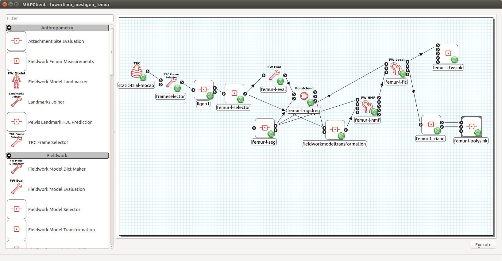

*****************************
Bone Mesh Generation Workflow
*****************************

This document describes how to build and run MAP Client workflows for
generating lower-limb bone meshes from FAI-project mocap data and MRI
segmentations.

Background
==========

Generating patient-specific meshes of lower limb bones from FAI data
require the fusion of mocap marker data and sparse MRI segmentations.
This workflow first uses a statistical shape model of the lower limb to
estimate bone meshes from mocap data, then registers the meshes to the
segmented surfaces of each bone. Once registered, the meshes can be
fitted to the segmented surfaces to improve patient-specificity.

The output meshes (pelvis, femurs, patellas, tibias, fibulas) are used
in the OpenSim Model Generation Workflow to produce a patient-specific
Gait2392 model.

Inputs Data
===========

-  TRC file of mocap static-trial
-  Preprocessed segmentations of all the bones

Preprocessing Segmentations
---------------------------

The segmented bone surfaces should only contain vertices on actual bone
surfaces. This is because the workflow will be fitting surface meshes to
the vertices in the segmentations. If a segmentation has ends that are
truncated, check if the truncated ends have been "closed" by the
segmentation software. The closing operation tends to introduce vertices
"inside" the bone.

1. Open a segmented surface in a processing application such as MeshLab.
2. View the truncated ends of the surface. They tend to be flat surfaces
   where the bone has been abruptly cut off.
3. Select the faces and vertices on the truncated ends and delete them.
   In MeshLab, you can use the paintbrush tool to "paint" the faces on
   the ends and delete the faces with their surrounding vertices.
4. Export the modified surface.

Output Data
===========

The workflow described will output two meshes for each bone. One is an
STL (or other similar format) file of the patient-specific bone. The
other is a GEOF file of the patient-specific bone in an internal format
(see Fieldwork Models in the glossary).

Building the Workflow
=====================

These instructions will create a workflow that produces the meshes for 1
bone for 1 case. The steps can be replicated to output meshes for other
bones. Details on each of the plugins/steps used can be found in their
respective readme files.

1.  Start a new workflow: *File>New>Workflow* and create a new folder
    for the workflow and click *Open* inside that folder.
2.  Add the **TRC Source** step to the workspace. Configure it with the
    case's static-trial TRC file.
3.  Add the **TRC Frame Selector** step to the workspace. Connect the
    output port of **TRC Source Step** to the first port of **TRC Frame
    Selector Step**. Configure the step to read particular frame.
4.  Add the **Fieldwork Lower Limb (2 sides) Generation** step to the
    workspace. Connect the output port of **TRC Frame Selector Step** to
    the input port. Configure the step:

    -  PCs to Fit: 1
    -  Mahalanobis Weight: 0.1
    -  Landmarks:

       -  femur-HC-l : LHJC
       -  femur-HC-r : RHJC
       -  femur-LEC-l : LLFC
       -  femur-LEC-r : RLFC
       -  femur-MEC-l : LMFC
       -  femur-MEC-r : RMFC
       -  pelvis-LASIS : LASI
       -  pelvis-LPSIS : LPSI
       -  pelvis-RASIS : RASI
       -  pelvis-RPSIS : RPSI
       -  tibiafibula-LM-l : LLMAL
       -  tibiafibula-LM-r : RLMAL
       -  tibiafibula-MM-l : LMMAL
       -  tibiafibula-MM-r : RMMAL

    -  Marker Radius: 5 (or whatever the marker radius was, unit is mm)
    -  Skin Padding : 5 (or whatever the patient soft-tisse was roughly,
       unit is mm)
    -  Knee Options : check Abd. DOF
    -  GUI : check

5.  Add the **Fieldwork Model Selector** step to the workflow. Connect
    the first output port of the **Fieldwork Lower Limb (2 sides)
    Generation** step to the input port. Configure the step:

    -  identifier should contain the name of the bone to be generated,
       e.g. femur-l-selector.
    -  Model Name should be one of:

       -  pelvis
       -  femur-l
       -  femur-r
       -  patella-l
       -  patella-r
       -  tibiafibula-l
       -  tibiafibula-r

6.  Add the **Fieldwork Model Evaluation** step to the workspace.
    Connect the output port of the **Fieldwork Model Selector** step to
    the input port. Configure the step:

    -  identifier : something like femur-l-eval
    -  discretisation: [10,10]
    -  node coordinates: False
    -  elements: the elements sampled should be where the segmented
       surfaces are on each bone. Therefore, the elements are different
       for each bone.

        -  Pelvis: 27-47, 64-67, 72, 100-120, 137-140, 145 
        -  Femurs: all
        -  Patellas: all
        -  tibiafibulas: 0-2, 10-23, 52-54, 72-83

7.  Add the **Pointwise Rigid Registration** step to the workspace.
    Connect the output port of the **Fieldwork Model Evaluation** step
    to the first input port. Configure the step:

    -  identifier: something like femur-l-rigidreg
    -  UI Mode: check
    -  Registration Method: ICP Rigid Target-Source
    -  Min Relative Error: 1e-6
    -  Points to Sample: 1000

8.  Add the **Polygon Source** step to the workspace. Connect its first
    output port to the second input port of the **Pointwise Rigid Registration** step to the.
    Configure the step:

    -  identifier: something like femur-l-seg
    -  File format: auto
    -  Filename: the filename of the segmented surface of the bone.

9.  Add the **Fieldwork Model Transformation** step to the workspace.
    Connect the second output port of the **Pointwise Rigid
    Registration** step to the second input port. Connect the output
    port of the **Fieldwork Model Selector** step to the first input
    port. This step does not need any configuring.
10. Add the **Fieldwork Host Mesh Fitting** step to the workspace.
    Connect the first output port of the **Polygon Source** step to the
    first input port. Connect the output port of the **Fieldwork Model
    Transformation** step to the second input port. Configure the step:

    -  identifier: something like femur-l-hmf
    -  GUI: True
    -  fit mode: DPEP
    -  host element type: quad444
    -  slave mesh discretisation: [10,10]
    -  slave sobelov discretisation: [4,4] ([5,5] for the femur mesh)
    -  slave sobelov weight: [1e-5, 1e-5, 1e-5, 1e-5, 2e-5]
    -  slave normal discretisation: 4 (5 for femur mesh)
    -  slave normal weight: 100
    -  max iterations: 5
    -  host sobelov discretisation: [4,4,4]
    -  host sobelov weight: 1e-5
    -  n closest points: 1
    -  kdtree args: {}
    -  verbose: True

11. Add the **Fieldwork Mesh Fitting** step to the workspace. Connect
    the first output port of the **Polygon Source** step to the first
    input port. Connect the output port of the **Fieldwork Host Mesh
    Fitting** step to the second input port. Configure the step:

    -  identifier: something like femur-l-fit
    -  GUI: True
    -  fit mode: DPEP
    -  mesh discretisation: 5.0
    -  sobelov discretisation: [4,4] ([5,5] for the femur mesh)
    -  sobelov weight: [1e-4, 1e-4, 1e-4, 1e-4, 2e-4]
    -  normal discretisation: 4 (5 for femur mesh)
    -  normal weight: 100
    -  max iterations: 2
    -  max sub-iterations: 2
    -  xtol: 1e-6
    -  n closest points: 1
    -  kdtree args: {}
    -  verbose: True
    -  fixed nodes: none

12. Add the **Fieldwork Model Triangulation** step to the workspace.
    Connect the first output port of the **Fieldwork Mesh Fitting** step
    to the input port. Configure the discretisation to a desired
    density, e.g. 10,10.
13. Add the **Polygon Serialiser** step the to workspace. Connect the
    first and second output ports of the **Fieldwork Model
    Triangulation** step to the first and second input ports,
    respectively. Configure the step:

    -  identifier: something like femur-l-polysink
    -  File Format: STL (or another format as desired)
    -  Filename: the file path to write the bone's STL file. E.g.
       /case\_xx/fitted\_meshes/femur-l.stl

14. Add the **Fieldwork Model Serialiser** step to the workflow. Connect
    the first output port of the **Fieldwork Mesh Fitting** step to the
    first input port. Configure the step:

    -  identifier: something like femur-l-fwsink
    -  GF Filename: the file path to write the bone's Fieldwork model
       .geof file. E.g. /case\_xx/fitted\_meshes/femur-l.geof

15. To fit another bone in the same workflow, create a branch in the
    workflow by repeating steps 5 to 15. Remember to name the identifier
    of each new step according to the new bone's name and configure the
    Model Name parameter in the **Fieldwork Model Selector** step to be
    that of the new bone.

Running the Workflow
====================

When the workflow is executed, the workflow steps are executed from
start to finish. The steps are explain below. Most steps are automatic
and do not have user interaction. They are denoted by [AUTO]. The
operation of the other steps are explain below. For more details on each
step's operation, please refer to their respective readme files.

1.  [AUTO] The **TRC Source** step read in the case's static-trial
    marker data.
2.  [AUTO] The **TRC Frame Selector** step extracts the marker names and
    locations at a specified frame.
3.  The **Fieldwork Lower Limb Generation** step registers the
    lower-limb shape model to the specified markers, thereby generating
    approximately patient-specific meshes for each lower limb bone. 

    .. image:: images/plugins_llgen.png

    When the GUI of this step appears, the lower limb model will be shown in
    its un-registered position away from the green markers. The step is
    preconfigured so simply click the *Register* button in the
    *Registration* tab. Registration will take around 2 minutes after
    which the model will be registered with the markers. The
    registration can be refined by increasing the *PCs to Fit* value to
    5 and clicking *Register* again. Model parameters can be manually
    adjusted in the *Manual Registration* tab. Click *Accept* to move
    onto the next step.
4.  [AUTO] The **Fieldwork Model Selector** step picks a specified bone
    mesh from the lower limb model.
5.  [AUTO] The **Fieldwork Model Evaluation** step discretises the
    selected mesh into a pointcloud for registration to the segmented
    surfaces.
6.  [AUTO] The *Polygon Source* step reads in the segmented surfaces.
7.  The **Pointwise Registration** step performs a rigid-body
    registration of the mesh pointcloud (5) to the segmented surface.

    .. image:: images/plugins_pointreg_femur.png

    When the GUI of this step appears, the source pointcloud
    (discretised mesh) is shown in green and the target in red
    (segmented). Play with the Euler *Rotation* angles until the yellow
    pointcloud (registered source) is roughly in the same orientation as
    the target, then click *Register* to perform an automatic ICP
    registration. The registration can be manually adjusted through the
    *Translation* and *Rotation* values. Click *Accept* to move onto the
    next step. [KNOWN BUG] Error messages concerning VTK will appear when the registered pointcloud updated in the 3-D viewer. This message can be ignored.
8.  [AUTO] The **Fieldwork Model Transformation** step applies the
    rigid-body registration transformation from (7) to the bone mesh
    from (4) to register it to the segmentation.
9.  The **Fieldwork Host Mesh Fitting Step** performs a host-mesh fit of
    the bone mesh to the segmentation to bring the mesh a bit closer to
    the segmentation before local mesh fitting.

    .. image:: images/plugins_hmf_femur.png

    The step is preconfigured so click *Fit* to start the fit. Fitting will take 1-2 minutes. After the fit finishes, you can click *Fit* again to improve the fit. A RMS error of less than 2.5 mm should be sufficient. Click *Accept* to move onto the next step.
10. The **Fieldwork Mesh Fitting Step** performs a final local mesh fit
    of the bone mesh to the segmentation.

    .. image:: images/plugins_fit_femur_0.png

    The step is preconfigured so click *Fit* to start the fit. Fitting will take 1-15 minutes depending on the size of the mesh (Pelvis will take the longest). After the fit finishes, you can click *Fit* again to improve the fit. A RMS error of around 1 mm should be sufficient. Click *Accept* to move onto the next step.
11. [AUTO] The **Fieldwork Model Serialiser** step writes the fitted
    mesh to file in the internal .geof format.
12. [AUTO] The **Fieldwork Model Triangulation** step discretises the
    fitted mesh into a triangulated surface mesh with the configured
    discretisation level.
13. [AUTO] The **Polygon Serialiser** step writes the triangulated
    surface mesh to file in the specified format (e.g. STL).

When the workflow is complete, MAP Client will return to the workspace
view.
